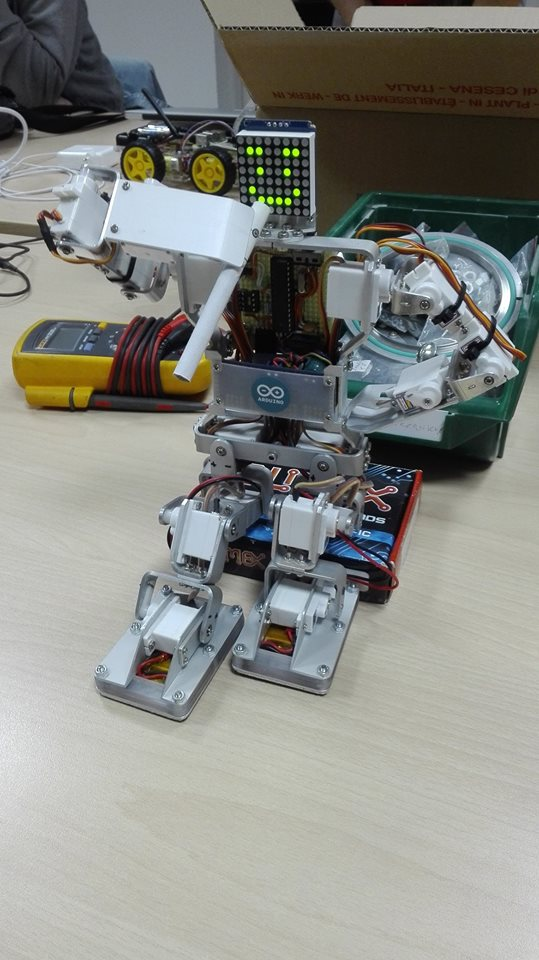

# Marvin the, uhm, smoker android?

Marvin is a small, low cost, 16 degrees of freedom humanoid (sometimes paranoid) robot.
 The firmware is Arduino (C++) based and the GUI is Qt (C++) based for high portability.
 Meet Marvin at [FabLab L'Aquila] (http://www.fablabaq.it/)

Credits:
 Hardware: [Luca Anastasio](https://github.com/luca-anastasio)
 Firmware and software: [Tomassino Ferrauto](https://github.com/Tomassino)
